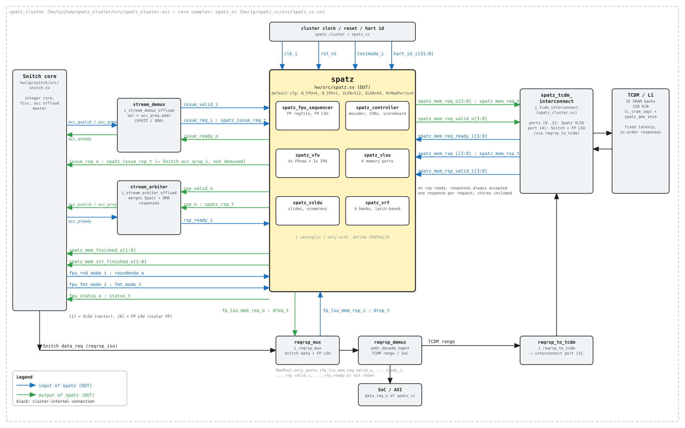

# Spatz Documentation (standalone `spatz_vpu`)

Spatz is a compact vector processing unit based on the RISC-V Vector Extension (RVV) v1.0, written in SystemVerilog.
It is a *coprocessor*: it does not fetch instructions itself, but receives them already fetched (and partially decoded) from a scalar core (Snitch) through an offload interface, and accesses memory through a set of narrow, parallel memory ports.

This document describes the standalone `spatz_vpu` package (top-level module `spatz`, file `hw/src/spatz.sv`) as seen from its boundary: interfaces, parameters, programming model, supported instructions and micro-architecture.
The content is reconstructed from the RTL in this repository, from the adopted protocols (TCDM, `reqrsp`) and from the reference integration in the Spatz cluster.

**Table of Contents**
- [Scope and File List](#scope-and-file-list)
- [Top-Level Interface](#top-level-interface)
  - [Parameters](#parameters)
  - [Ports](#ports)
  - [Data Types](#data-types)
  - [Handshake Interfaces](#handshake-interfaces)
  - [Instruction IDs and Tags](#instruction-ids-and-tags)
- [Programming Model](#programming-model)
  - [Vector CSRs](#vector-csrs)
  - [Configuration Instructions (`vsetvl*`)](#configuration-instructions-vsetvl)
  - [Vector Register File Layout](#vector-register-file-layout)
  - [Masking and Tail Policies](#masking-and-tail-policies)
  - [Floating-Point Behaviour](#floating-point-behaviour)
- [Supported Instructions](#supported-instructions)
- [Configuration](#configuration)
  - [Package Parameters (`spatz_pkg`)](#package-parameters-spatz_pkg)
  - [Generating the Package](#generating-the-package)
  - [Compile-Time Defines](#compile-time-defines)
  - [FPU Implementation](#fpu-implementation)
- [Architecture](#architecture)
  - [Top-Level](#top-level)
  - [FPU Sequencer](#fpu-sequencer)
  - [Controller](#controller)
  - [Scoreboard and Chaining](#scoreboard-and-chaining)
  - [Vector Register File (VRF)](#vector-register-file-vrf)
  - [Vector Functional Unit (VFU)](#vector-functional-unit-vfu)
  - [Vector Load/Store Unit (VLSU)](#vector-loadstore-unit-vlsu)
  - [Vector Slide Unit (VSLDU)](#vector-slide-unit-vsldu)
  - [Ventaglio (optional)](#ventaglio-optional)
- [Exceptions and Error Handling](#exceptions-and-error-handling)


## Scope and File List

The standalone package is described by `Bender.yml` (target `spatz`).
The RTL compilation order, bottom-up, is:

| Level | Files | Content |
|-------|-------|---------|
| 0 | `hw/src/reorder_buffer.sv`, `hw/src/rvv_pkg.sv`, `hw/src/vtl_pkg.sv` | RVV types, Ventaglio types, reorder buffer (MemPool only) |
| 1 | `hw/src/generated/spatz_pkg.sv`, `hw/src/spatz_serdiv.sv` | Configuration package (generated), serial divider |
| 2 | `hw/src/spatz_decoder.sv`, `hw/src/spatz_simd_lane.sv`, `hw/src/vregfile.sv` (or `vregfile_fpga.sv` for target `fpga`) | Decoder, integer SIMD lane, latch-based register file bank |
| 3 | `hw/src/spatz_fpu_sequencer.sv`, `spatz_ipu.sv`, `spatz_vfu.sv`, `spatz_vlsu.sv`, `spatz_doublebw_vlsu.sv`, `spatz_vrf.sv`, `spatz_vsldu.sv` | Functional units, VRF |
| 4 | `hw/src/spatz_controller.sv` | Controller (CSRs, issue, scoreboard, retire) |
| 5 | `hw/src/spatz.sv` | Top level |

Optional Ventaglio sources (target `ventaglio`) live in `hw/ip/ventaglio/`.

External dependencies (`Bender.yml` / `Bender.lock`): `common_cells`, `FPnew` (cvfpu, `pulp-v0.1.3`), `tech_cells_generic`, `snitch` (local, `hw/ip/snitch`: provides `riscv_instr`, `snitch_regfile`, `snitch_lsu`), `reqrsp_interface` (local).
The FPU inside Spatz is FPnew: its behaviour is documented in `FPNEW_SPEC.md` and is not repeated here.


## Top-Level Interface

The top-level module is `spatz`. All interfaces are synchronous to `clk_i`, rising edge.
All struct types on the boundary are **type parameters**, supplied by the integrating system; the fields Spatz actually uses are listed in [Data Types](#data-types).

The block diagram below shows every port of `spatz` (inputs in blue, outputs in green) and the cluster blocks it connects to in the reference integration (`spatz_cc` / `spatz_cluster`).
The editable source is [spatz_block_diagram.excalidraw](spatz_block_diagram.excalidraw): open it on [excalidraw.com](https://excalidraw.com) (*Menu → Open*) or with the Excalidraw VS Code extension.
Both files are generated by [fig/gen_spatz_block_diagram.py](fig/gen_spatz_block_diagram.py) (`python3 fig/gen_spatz_block_diagram.py .` from `docs/`); if you edit the diagram by hand in Excalidraw, re-export the SVG from there instead of re-running the script.



### Parameters

The top-level parameters are **not** taken from `spatz_pkg`: they are set by the module that instantiates `spatz` (in the cluster, `spatz_cc`, fed by the wrapper generated from the hjson config). When `spatz` is instantiated standalone no wrapper exists, so the instantiating module has to set them itself; use the values below to match the reference cluster.

| Parameter | Default | Knob (hjson key) | Description |
|-----------|---------|------------------|-------------|
| `NrMemPorts` | `4` | `spatz_nports` | VLSU memory ports. Must equal `spatz_pkg::N_FU` and be a power of two |
| `RegisterRsp` | `1` | `timing.register_offload_rsp` | Unused by the controller (response always registered) |
| `NumOutstandingLoads` | `4` | `cores[i].num_spatz_outstanding_loads` | Outstanding FP LSU requests. The VLSU ignores it (always 8) |
| `FPUImplementation` | see [FPU Implementation](#fpu-implementation) | `timing.lat_*`, `timing.fpu_pipe_config` | FPnew `Implementation` for all FPUs |
| `spatz_mem_req_t` | `tcdm_req_chan_t` | `tcdm.size`, `data_width`, `num_spatz_outstanding_loads` | VLSU request channel (per port) |
| `spatz_mem_rsp_t` | `tcdm_rsp_chan_t` | `data_width` | VLSU response channel (per port) |
| `dreq_t` | `reqrsp_req_t` | `addr_width`, `data_width` | FP LSU request |
| `drsp_t` | `reqrsp_rsp_t` | `addr_width`, `data_width` | FP LSU response |
| `spatz_issue_req_t` | `acc_issue_req_t` | `addr_width`, `data_width` | Offload request |
| `spatz_issue_rsp_t` | `acc_issue_rsp_t` | — (fixed) | Offload immediate response |
| `spatz_rsp_t` | `acc_rsp_t` | `data_width` | Offload write-back response |

Hjson keys are relative to the `cluster` object of `hw/system/spatz_cluster/cfg/spatz_cluster.default.dram.hjson`.
The *Default* column is the value resulting from that file, not the default of the `spatz` module declaration (which for `FPUImplementation` is `'0`, i.e. every FPnew unit disabled: a standalone instantiation must always pass it explicitly).

**Where each knob is applied.** All knobs follow the same file chain; the table gives the name the value takes at each step.

```
spatz_cluster.<cfg>.dram.hjson
  → util/clustergen.py renders src/spatz_cluster_wrapper.sv.tpl → src/generated/spatz_cluster_wrapper.sv
  → hw/system/spatz_cluster/src/spatz_cluster.sv
  → hw/ip/spatz_cc/src/spatz_cc.sv
  → spatz #(...)
```

| Parameter | Wrapper (`spatz_cluster_wrapper.sv.tpl`) | `spatz_cluster.sv` | `spatz_cc.sv` |
|-----------|------------------------------------------|--------------------|---------------|
| `NrMemPorts` | `NumSpatzTCDMPorts[]` | `.NumMemPortsPerSpatz` | `NumMemPortsPerSpatz` |
| `RegisterRsp` | `.RegisterOffloadRsp` | `RegisterOffloadRsp` | `RegisterOffloadRsp` |
| `NumOutstandingLoads` | `NumSpatzOutstandingLoads[]` | `NumSpatzOutstandingLoads[i]` | `NumSpatzOutstandingLoads` |
| `FPUImplementation` | `FPUImplementation[]` | `FPUImplementation[i]` | `FPUImplementation` |
| `spatz_mem_*_t` | `TCDMSize`, `NarrowAXIDataWidth` | `TCDM_TYPEDEF_ALL(tcdm, ...)`, `tcdm_user_t` | `tcdm_req_chan_t` / `tcdm_rsp_chan_t` |
| `dreq_t` / `drsp_t` | `AxiAddrWidth`, `NarrowAXIDataWidth` | `REQRSP_TYPEDEF_ALL(reqrsp, ...)` | `reqrsp_req_t` / `reqrsp_rsp_t` |
| `spatz_issue_*_t`, `spatz_rsp_t` | `AxiAddrWidth`, `NarrowAXIDataWidth` | structs `acc_issue_req_t`, `acc_issue_rsp_t`, `acc_rsp_t` | `acc_issue_req_t`, `acc_issue_rsp_t`, `acc_rsp_t` |

Notes on `FPUImplementation`: only the ADDMUL/NONCOMP/CONV/DOTP `PipeRegs` and `PipeConfig` come from the hjson. The DIVSQRT `PipeRegs` and all `UnitTypes` are hard-coded in the wrapper template.

Resulting type layouts with the default config:

| Type | Fields (width) |
|------|----------------|
| `tcdm_req_chan_t` | `addr` (17, = `$clog2(tcdm.size·1024)`), `write`, `amo`, `data` (64), `strb` (8), `user` (3: `{is_core, req_id[1:0]}`) |
| `tcdm_rsp_chan_t` | `data` (64) |
| `reqrsp_req_t` | `q.{addr (32), write, amo, data (64), strb (8), size}`, `q_valid`, `p_ready` |
| `reqrsp_rsp_t` | `p.{data (64), error}`, `p_valid`, `q_ready` |
| `acc_issue_req_t` | `addr` (32), `id` (6), `data_op` (32), `data_arga` (64), `data_argb` (64), `data_argc` (32) |
| `acc_issue_rsp_t` | `accept`, `writeback`, `loadstore`, `exception`, `isfloat` |
| `acc_rsp_t` | `id` (6), `error`, `data` (64) |

The micro-architectural sizes (`N_FPU`, `N_IPU`, `VLEN`, `ELEN`, …) come from the same hjson through a separate path, the generated `spatz_pkg` (see [Package Parameters](#package-parameters-spatz_pkg) and [Generating the Package](#generating-the-package)). Feature switches come from compile-time defines (see [Compile-Time Defines](#compile-time-defines)). Nothing checks that the three paths agree.

### Ports

`W` denotes a width set by the type parameters.

| Port Name | Direction | Type | Description |
|-----------|-----------|------|-------------|
| `clk_i` | in | `logic` | Clock, rising-edge triggered |
| `rst_ni` | in | `logic` | Asynchronous reset, active low |
| `testmode_i` | in | `logic` | Test mode, bypasses the clock gates of the latch-based VRF |
| `hart_id_i` | in | `logic [31:0]` | Hart ID. Only used for trace file names and as FPnew `hart_id_i` (stochastic rounding seed) |
| **Offload issue** | | | |
| `issue_valid_i` | in | `logic` | Offload request valid |
| `issue_ready_o` | out | `logic` | Offload request ready |
| `issue_req_i` | in | `spatz_issue_req_t` | Offloaded instruction and scalar operands |
| `issue_rsp_o` | out | `spatz_issue_rsp_t` | Immediate response (accept / exception / flags), valid in the handshake cycle |
| **Offload write-back** | | | |
| `rsp_valid_o` | out | `logic` | Write-back response valid |
| `rsp_ready_i` | in | `logic` | Write-back response ready |
| `rsp_o` | out | `spatz_rsp_t` | Write-back data to the integer register file of the core |
| **VLSU memory** (one set per port) | | | |
| `spatz_mem_req_o` | out | `spatz_mem_req_t [NrMemPorts-1:0]` | Memory request payload |
| `spatz_mem_req_valid_o` | out | `logic [NrMemPorts-1:0]` | Memory request valid |
| `spatz_mem_req_ready_i` | in | `logic [NrMemPorts-1:0]` | Memory request ready |
| `spatz_mem_rsp_i` | in | `spatz_mem_rsp_t [NrMemPorts-1:0]` | Memory response payload |
| `spatz_mem_rsp_valid_i` | in | `logic [NrMemPorts-1:0]` | Memory response valid. **There is no response ready**: responses must always be accepted |
| **Memory completion side channel** | | | |
| `spatz_mem_finished_o` | out | `logic [1:0]` | Pulse: a memory instruction finished. `[1]` = VLSU (vector), `[0]` = FP LSU (scalar FP) |
| `spatz_mem_str_finished_o` | out | `logic [1:0]` | Pulse: the finished instruction was a store. Same bit mapping. Only meaningful when the corresponding `finished` bit is set |
| **FP LSU memory** | | | |
| `fp_lsu_mem_req_o` | out | `dreq_t` | FP load/store request (`q` channel + `p_ready`) |
| `fp_lsu_mem_rsp_i` | in | `drsp_t` | FP load/store response (`p` channel + `q_ready`) |
| `fp_lsu_mem_req_valid_o` | out | `logic` | Only with `` `MEMPOOL_SPATZ `` |
| `fp_lsu_mem_req_ready_i` | in | `logic` | Only with `` `MEMPOOL_SPATZ `` |
| `fp_lsu_mem_rsp_valid_i` | in | `logic` | Only with `` `MEMPOOL_SPATZ `` |
| `fp_lsu_mem_rsp_ready_o` | out | `logic` | Only with `` `MEMPOOL_SPATZ `` |
| **FPU side channel** | | | |
| `fpu_rnd_mode_i` | in | `fpnew_pkg::roundmode_e` | Dynamic rounding mode (`fcsr.frm` of the core) |
| `fpu_fmt_mode_i` | in | `fpnew_pkg::fmt_mode_t` | Alternate FP format selection (`{src, dst}`): selects FP16ALT/FP8ALT instead of FP16/FP8 |
| `fpu_status_o` | out | `fpnew_pkg::status_t` | FP exception flags (`{NV, DZ, OF, UF, NX}`), to be OR-accumulated into `fcsr.fflags` by the core |

### Data Types

#### Offload interface types

Spatz accesses these structs only by field name, so any struct providing the fields below can be used.
The layout used by the reference integration (`spatz_cluster.sv`) is:

```SystemVerilog
typedef struct packed {
  acc_addr_e   addr;      // accelerator selector (SPATZ = 0). NOT used by Spatz
  logic [5:0]  id;        // destination register tag (see below)
  logic [31:0] data_op;   // 32-bit instruction encoding
  data_t       data_arga; // rs1 value (sign-extended to data_t)
  data_t       data_argb; // rs2 value (sign-extended to data_t)
  addr_t       data_argc; // effective address for scalar FP loads/stores (rs1 + imm)
} acc_issue_req_t;

typedef struct packed {
  logic accept;           // instruction accepted and will be executed
  logic writeback;        // instruction will produce a write-back on rsp_o
  logic loadstore;        // instruction is a (vector or FP) memory operation
  logic exception;        // instruction is illegal / not executable
  logic isfloat;          // at least one vector instruction is running (fcsr must not be read)
} acc_issue_rsp_t;

typedef struct packed {
  logic [5:0] id;         // destination register tag, copied from the request
  logic       error;      // always 0
  data_t      data;       // result
} acc_rsp_t;
```

| Field | Usage in Spatz |
|-------|----------------|
| `id[4:0]` | Destination register index (integer `rd` or FP `fd`). Echoed back in `rsp_o.id` |
| `id[5]` | Set internally by the FPU sequencer when the destination is an FP register; FP results are consumed internally and never reach `rsp_o`. The core must drive `id[5] = 0` |
| `data_op` | Instruction encoding, decoded by the FPU sequencer and by the Spatz decoder |
| `data_arga` | `rs1` operand (base address for vector memory ops, AVL for `vsetvl*`, scalar operand for `.vx`) |
| `data_argb` | `rs2` operand (stride for strided memory ops, `vtype` for `vsetvl`) |
| `data_argc` | Effective address for FP loads/stores (non-MemPool build). For FP FMA the FPU sequencer overwrites it with `fs3` |

`data_t` must be at least `ELEN` bits wide (64 in the default config) since it carries `elen_t` values; `data_arga/argb` are truncated/extended to `elen_t` internally.

#### VLSU memory types

The VLSU drives the following fields of `spatz_mem_req_t` (non-MemPool build), matching the TCDM channel type `TCDM_TYPEDEF_REQ_CHAN_T` of `tcdm_interface/typedef.svh`:

```SystemVerilog
typedef struct packed {
  addr_t               addr;  // byte address, always aligned to ELEN/8 (8 bytes)
  logic                write; // 1 = store, 0 = load
  reqrsp_pkg::amo_op_e amo;   // always AMONone
  data_t               data;  // ELEN bits (64), store data (byte lanes selected by strb)
  strb_t               strb;  // ELEN/8 bits (8), byte enables for stores
  user_t               user;  // always '0
} spatz_mem_req_t;

typedef struct packed {
  data_t data;                // ELEN bits (64), load data (full aligned word)
} spatz_mem_rsp_t;
```

- `data_t` **must** be exactly `ELEN` bits (`$error` otherwise).
- The address type is chosen by the integrator (the cluster uses a narrow TCDM address); the VLSU computes 32-bit addresses internally, so a 32-bit `addr_t` is recommended for a standalone instantiation.
- `strb` is driven for loads too, but is only meaningful for stores.
- In the `` `MEMPOOL_SPATZ `` build the request additionally has `id`, `mode`, `size`, `last`, `spec` and the response has `id` and `write` (out-of-order responses reordered by `reorder_buffer`). This is not the default standalone configuration.

#### FP LSU memory types

`dreq_t`/`drsp_t` follow `reqrsp_interface` (`REQRSP_TYPEDEF_ALL`):

```SystemVerilog
typedef struct packed {
  struct packed { addr_t addr; logic write; reqrsp_pkg::amo_op_e amo;
                  data_t data; strb_t strb; reqrsp_pkg::size_t size; } q;
  logic q_valid;
  logic p_ready;
} dreq_t;

typedef struct packed {
  struct packed { data_t data; logic error; } p;
  logic p_valid;
  logic q_ready;
} drsp_t;
```

The request is generated by a `snitch_lsu` instance (FLEN = 64 bits, NaN-boxing enabled).

#### Types from `rvv_pkg`

```SystemVerilog
typedef enum logic [2:0] { EW_8 = 3'b000, EW_16 = 3'b001, EW_32 = 3'b010, EW_64 = 3'b011 } vew_e;
typedef enum logic [2:0] { LMUL_RES = 3'b100, LMUL_F8 = 3'b101, LMUL_F4 = 3'b110, LMUL_F2 = 3'b111,
                           LMUL_1 = 3'b000, LMUL_2 = 3'b001, LMUL_4 = 3'b010, LMUL_8 = 3'b011 } vlmul_e;
typedef struct packed { logic vill; logic vma; logic vta; vew_e vsew; vlmul_e vlmul; } vtype_t;
```

`vtype_t` is 9 bits; the CSR `vtype` read value is `{vill, vma, vta, vsew, vlmul}` zero-extended (note: `vill` is at bit 8, not at bit XLEN-1 as in the RVV specification).

#### Types from `fpnew_pkg`

`roundmode_e`, `status_t` and the FP formats are documented in `FPNEW_SPEC.md`. The FPnew version used by Spatz additionally has the formats `FP8ALT` and the `SDOTP` operation / `DOTP` operation group (used by `vfwdotp`), and `fmt_mode_t = struct packed { logic src; logic dst; }`.

### Handshake Interfaces

All channels use a `valid`/`ready` handshake: a transfer happens on a rising edge with both asserted. Specific rules per interface:

#### Offload issue (`issue_*`)

- The core asserts `issue_valid_i` with a stable `issue_req_i` until `issue_ready_o` is seen.
- `issue_ready_o` **depends combinationally on `issue_valid_i` and `issue_req_i`** (the FPU sequencer decodes `data_op` to decide whether the instruction is local or forwarded and whether its FP operands are available). This is legal (ready may depend on valid), but the driver must never change the payload while valid is high.
- `issue_rsp_o` (except `isfloat`) is only meaningful in the cycle where `issue_valid_i && issue_ready_o`. It is combinational on the request.
- `issue_rsp_o.isfloat` is a level signal, high whenever at least one vector instruction is in flight.
- An illegal instruction **is consumed** (`issue_ready_o` = 1) and answered with `accept = 0, exception = 1`; it is not executed.
- The Snitch core only uses `loadstore` and `isfloat`; `accept`, `writeback` and `exception` are exposed for completeness and for checking.

#### Offload write-back (`rsp_*`)

- `rsp_o` is driven by a non-bypassable spill register: `rsp_valid_o` and `rsp_o` are registered outputs and remain stable until `rsp_ready_i`.
- A response is produced for:
  - every `vsetvl`/`vsetvli`/`vsetivli` (data = new `vl`) and every vector CSR access (data = CSR read value), **regardless of `rd`** (also when `rd = x0`);
  - every integer-destination scalar operation executed in Spatz: `vmv.x.s`, scalar `mul*/div*/rem*`, FP compares/classify/`fcvt.w*` (destination integer register), and `fmv.x.{b,h,w}` (executed in the FPU sequencer).
- Results with an FP destination (`vfmv.f.s`, scalar FP arithmetic, FP loads, `fmv.{b,h,w}.x`) are written to the internal FP register file and **do not appear on `rsp_o`**.
- Vector instructions writing the VRF or memory never produce a response.
- Backpressure on `rsp_ready_i` eventually stalls the issue of further CSR/config instructions and of scalar VFU operations.

#### VLSU memory ports (`spatz_mem_*`)

- Each port is independent. Requests leave from a spill register (registered outputs); `valid` is held until `ready`.
- `ready` may be deasserted arbitrarily (bank conflicts, backpressure).
- **Responses must be returned in request order per port** (non-MemPool build: the "reorder buffer" is a FIFO).
- **Every request, including stores, must receive exactly one response** (`spatz_mem_rsp_valid_i` pulse). Store responses are counted to track completion; if a store is not acknowledged, later load responses on that port are dropped (the VLSU only pushes load data into its buffer when its per-port outstanding-store counter is zero).
- There is no response `ready`: the memory model must never expect backpressure on responses. For loads the VLSU never has more than 8 requests per port outstanding or buffered (bounded by its offset queue), so its buffers cannot overflow. Stores are **not** limited by the VLSU; the per-port store-acknowledge counter is only 3 bits wide, so the memory must not keep more than 7 stores per port unacknowledged.
- Response latency may be any value ≥ 1 cycle (TCDM in the cluster: fixed latency).
- No error signalling: memory errors are not reported by the VLSU (`vlsu_rsp_t.exc` is never set in the non-MemPool build).

#### FP LSU (`fp_lsu_mem_*`)

Standard `reqrsp` protocol: two independent valid/ready channels (`q` and `p`), responses in order, one response per request (including stores). Up to `NumOutstandingLoads` outstanding requests.

#### Memory completion side channel

`spatz_mem_finished_o[1]` pulses once per completed vector memory instruction (for segmented instructions only on the last segment); `spatz_mem_str_finished_o[1]` pulses together with it when that instruction was a store. The same holds for bit `[0]` and scalar FP loads/stores. The core uses these pulses to order its own scalar memory accesses with respect to Spatz memory accesses. The FPU sequencer uses bit `[1]` in the same way to order FP loads/stores after vector stores.

#### FPU side channel

`fpu_rnd_mode_i` and `fpu_fmt_mode_i` are "untimed": they are sampled by the decoder in the cycle the instruction is accepted and travel with the instruction. `fpu_status_o` is the OR of the registered FPnew `status_o` of all FPUs, updated every cycle; it is intended to be OR-accumulated (sticky) into `fflags`, not to be sampled per instruction.

### Instruction IDs and Tags

Internally, every accepted non-CSR instruction gets an ID of type `spatz_id_t` (`$clog2(NrParallelInstructions)` bits, 2 bits by default) allocated with find-first-one among free slots. At most `NrParallelInstructions` (4, or 8 with Ventaglio) vector instructions can be in flight; the IDs are not visible on the boundary. The boundary tag is the `id` field of the offload interface, which is only echoed for write-back responses.


## Programming Model

### Vector CSRs

| CSR | Address | Access | Behaviour |
|-----|---------|--------|-----------|
| `vstart` | `0x008` | RW | Written by `csrrw[i]`, set by `csrrs[i]`, cleared by `csrrc[i]`. Reset to 0 by every accepted non-CSR instruction (including `vsetvl*`) |
| `vxsat` | `0x009` | RW | Reads as 0, writes ignored (no fixed-point support) |
| `vxrm` | `0x00A` | RW | Reads as 0, writes ignored |
| `vcsr` | `0x00F` | RW | Reads as 0, writes ignored |
| `vl` | `0xC20` | RO | Read returns `vl`. Writes via `csrrw` are ignored (no error) |
| `vtype` | `0xC21` | RO | Read returns `{vill, vma, vta, vsew, vlmul}` |
| `vlenb` | `0xC22` | RO | Read returns `VLENB` (64 in the default config) |
| `vtlreg` | `0x7C8` | RW | Ventaglio: bitmap of vector registers mapped to the VTL bank (only with `` `VENTAGLIO ``) |
| `vtlidxw` | `0x7C9` | RW | Ventaglio: index width (`sp_idxw_e`) |
| `vtlblks` | `0x7CA` | RW | Ventaglio: block size (`sp_blk_e`, currently unused by the datapath) |
| `vtlratio` | `0x7CB` | RW | Ventaglio: sparsity ratio (`sp_ratio_e`) |

Any other CSR address offloaded to Spatz is illegal. Without `` `VENTAGLIO `` the `vtl*` addresses are still accepted by the decoder but have no effect (read 0).

Reset values: `vstart = 0`, `vl = 0`, `vtype = {vill: 1, vsew: EW_8, vlmul: LMUL_1, others 0}`.

The CSR read is performed when the CSR instruction reaches the issue stage, i.e. in order with respect to other instructions, and all CSR/config instructions retire in order through `rsp_o`.

### Configuration Instructions (`vsetvl*`)

`vsetvli`, `vsetivli` and `vsetvl` are executed by the controller (unit `CON`) and always produce a response with the new `vl`.

- `vtype` source: immediate `[27:20]` for `vsetvli`/`vsetivli`, `rs2[7:0]` for `vsetvl` (`vill` of the new value forced to 0).
- AVL source: `rs1` value for `vsetvli`/`vsetvl`, the 5-bit `uimm` for `vsetivli`.
- If `rs1 = x0` and `rd != x0`: AVL = all-ones, i.e. `vl = VLMAX`.
- If `rs1 = x0` and `rd = x0` (*keep-vl*): `vl` is preserved; if the new `vtype` changes the `SEW/LMUL` ratio, `vtype` is set to illegal.
- `vtype` is illegal (`vill = 1`, `vl = 0`) if `vsew > MAXEW`, or `vlmul ∈ {LMUL_RES, LMUL_F8}`, or `vlmul + log2(ELEN) < vsew` (fractional LMUL too small for SEW).
- `VLMAX = (VLENB >> vsew) << vlmul` (right-shift for fractional LMUL). `vl = min(AVL, VLMAX)`.
- `vma` and `vta` are stored; `vta` has no effect on execution (see below).

### Vector Register File Layout

- 32 vector registers of `VLEN` bits.
- The VRF is organised in words of `VRFWordWidth = N_FU * ELEN` bits (256 in the default config). Each register has `NrWordsPerVector = VLEN / VRFWordWidth` words (2 by default).
- VRF word address = `vreg * NrWordsPerVector + word`; `vrf_addr_t` is `$clog2(32 * NrWordsPerVector)` bits (6 by default).
- Element `i` of a register with element width `SEW` occupies bytes `[i*SEW/8 +: SEW/8]` of the register, word-linear (byte `b` of the register is in word `b / (VRFWordWidth/8)`).
- Register groups (LMUL > 1) are consecutive registers, as in RVV.
- The VRF is **not reset** (latch array): its content after reset is undefined (X in simulation).

### Masking and Tail Policies

- Masked execution (`vm = 0`, mask in `v0`) is supported by VFU arithmetic, comparisons, reductions, VLSU loads/stores and VSLDU.
- Inactive elements are **mask-undisturbed** for arithmetic, loads and slides (not written: byte enables are cleared).
- For comparisons (mask-producing), inactive bits follow `vtype.vma`: `vma = 1` → written as 1 (agnostic), `vma = 0` → undisturbed (the old `vd` is read first).
- Tail elements are **always undisturbed** (byte enables limited to `vl`), independent of `vtype.vta`. For mask-producing instructions, the whole mask bytes up to `ceil(vl/8)` are written.
- Masked stores disable the corresponding `strb` bits.

### Floating-Point Behaviour

- Supported FP formats (default, `RVD = 1`): FP64, FP32, FP16, FP16ALT (bfloat16), FP8, FP8ALT, selected by SEW and `fpu_fmt_mode_i` (`src`/`dst` bit set → ALT format for SEW 16/8).
- Rounding: the dynamic rounding mode `fpu_rnd_mode_i` is used for vector FP instructions. The instruction `rm` field is used only for scalar `fcvt.w*` / `fcvt.wu*`; `vfcvt.rtz.*` force `RTZ`.
- Widening FP instructions widen the operands before the FPU with a simple exponent re-bias (`widen_fp*_to_fp*` in `spatz_pkg`), not through an FPnew conversion: denormals, infinities and NaNs of the narrow format are not converted per IEEE rules.
- NaN-boxing is checked on FPU inputs (`EnableNanBox = 1`).
- No division or square root: `FDivSqrt = 0`, `vfdiv*`, `vfsqrt`, `vfrdiv` and scalar `fdiv/fsqrt` are illegal.
- Exception flags: see `fpu_status_o`. `simd_mask_i` of FPnew is tied to `'1`, so flags of inactive/tail SIMD lanes are not masked.


## Supported Instructions

> **Reference:** the full RVV 1.0 instruction list with the Spatz support status is maintained in the spreadsheet [Spatz_instructions_list_full_RVV.xlsx](https://chipsit-my.sharepoint.com/:x:/r/personal/riccardo_giunti_chips_it/Documents/Desktop/Spatz_instructions_list_full_RVV.xlsx?d=wa1711a945eb543e0b7f7059e21d03346&csf=1&web=1&e=LDIxYs) (Chips-IT SharePoint).
> The tables below are derived from the decoder RTL (`hw/src/spatz_decoder.sv`, `hw/src/spatz_fpu_sequencer.sv`); in case of mismatch, the RTL defines the actual behaviour.

Unit legend: **CON** = controller, **VFU** = vector functional unit (IPU = integer, FPU = FPnew), **LSU** = VLSU, **SLD** = VSLDU, **SEQ** = FPU sequencer (local execution). **WB** = produces a response on `rsp_o`.
Any encoding not listed below is illegal. The list of instructions covered by the software regression is in `sw/riscvTests/CMakeLists.txt`.

#### Configuration and CSR

| Instructions | Unit | WB |
|--------------|------|----|
| `vsetvli`, `vsetivli`, `vsetvl` | CON | yes (`vl`) |
| `csrrw`, `csrrs`, `csrrc`, `csrrwi`, `csrrsi`, `csrrci` on vector CSRs | CON | yes (old value) |

#### Vector loads and stores

| Instructions | Addressing | Notes |
|--------------|------------|-------|
| `vle{8,16,32,64}.v`, `vse{8,16,32,64}.v` | unit stride | `nf = 0` |
| `vlseg<nf>e{8,16,32,64}.v`, `vsseg<nf>e{8,16,32,64}.v` | unit stride, segmented | `nf` = 2..8; register `vd + field` per field |
| `vlse{8,16,32,64}.v`, `vsse{8,16,32,64}.v` | constant stride (`rs2`, bytes) | |
| `vluxei{8,16,32,64}.v`, `vloxei{…}.v`, `vsuxei{…}.v`, `vsoxei{…}.v` | indexed (`vs2`), byte offsets | ordered and unordered handled identically (sequential). Index EEW 64 uses only the low 32 bits |
| `vlx{8,16,32,64}.v` | Ventaglio custom indexed load (`mew = 1` encoding) | decoded in every build, intended for the VTL |

All memory instructions support `vm`. EEW = 64 is illegal if `MAXEW != EW_64`. Not supported: fault-only-first, whole-register (`vl<n>r`, `vs<n>r`), mask (`vlm`, `vsm`), strided/indexed segment accesses.

#### Integer arithmetic (VFU/IPU)

| Group | Instructions |
|-------|--------------|
| Add/sub | `vadd.{vv,vx,vi}`, `vsub.{vv,vx}`, `vrsub.{vx,vi}` |
| Widening add/sub | `vwadd[u].{vv,vx}`, `vwsub[u].{vv,vx}` (no `.wv/.wx` forms) |
| Carry | `vadc.{vvm,vxm,vim}`, `vmadc.{vv,vx,vi,vvm,vxm,vim}`, `vsbc.{vvm,vxm}`, `vmsbc.{vv,vx,vvm,vxm}` |
| Logic | `vand/vor/vxor.{vv,vx,vi}` |
| Shift | `vsll/vsrl/vsra.{vv,vx,vi}` |
| Min/max | `vmin[u]/vmax[u].{vv,vx}` |
| Compare | `vmseq/vmsne.{vv,vx,vi}`, `vmsltu/vmslt.{vv,vx}`, `vmsleu/vmsle.{vv,vx,vi}`, `vmsgtu/vmsgt.{vx,vi}` |
| Multiply | `vmul/vmulh/vmulhu/vmulhsu.{vv,vx}`, `vwmul/vwmulu/vwmulsu.{vv,vx}` |
| Divide | `vdiv[u]/vrem[u].{vv,vx}` (serial divider, multi-cycle) |
| Multiply-add | `vmacc/vnmsac/vmadd/vnmsub.{vv,vx}`, `vwmacc/vwmaccu/vwmaccsu.{vv,vx}`, `vwmaccus.vx` |
| Merge | `vmerge.{vvm,vxm,vim}` |
| Reductions | `vredsum/vredand/vredor/vredxor/vredmin/vredminu/vredmax/vredmaxu.vs` |
| Mask logical | `vmand/vmandn/vmor/vmxor/vmorn/vmnand/vmnor/vmxnor.mm` |
| Scalar move | `vmv.x.s` (WB) |

Not supported: narrowing shifts (`vnsrl`, `vnsra`), `vsext/vzext`, `vid`, `viota`, `vcpop`, `vfirst`, `vmsbf/vmsif/vmsof`, fixed-point instructions.

#### Permutation (VSLDU)

`vmv.v.{v,x,i}`, `vmv.s.x`, `vslideup.{vx,vi}`, `vslide1up.vx`, `vslidedown.{vx,vi}`, `vslide1down.vx`, `vfslide1up.vf`, `vfslide1down.vf`, `vfmv.v.f`, `vfmv.s.f`, `vcompress.vm`.
Not supported: `vrgather*`, `vmv<n>r.v`.

#### Floating-point (VFU/FPU)

| Group | Instructions |
|-------|--------------|
| Add/sub | `vfadd.{vv,vf}`, `vfsub.{vv,vf}`, `vfrsub.vf` |
| Multiply | `vfmul.{vv,vf}` |
| FMA | `vfmacc/vfnmacc/vfmsac/vfnmsac/vfmadd/vfnmadd/vfmsub/vfnmsub.{vv,vf}` |
| Min/max, sign | `vfmin/vfmax.{vv,vf}`, `vfsgnj/vfsgnjn/vfsgnjx.{vv,vf}` |
| Compare | `vmfeq/vmfne/vmflt/vmfle.{vv,vf}`, `vmfgt/vmfge.vf` |
| Convert | `vfcvt.{f.x,f.xu,x.f,xu.f,rtz.x.f,rtz.xu.f}.v`, `vfncvt.{f.x,f.xu,x.f,xu.f,rtz.x.f,rtz.xu.f,f.f}.w` |
| Widening | `vfwadd/vfwsub.{vv,vf,wv,wf}`, `vfwmul.{vv,vf}`, `vfwmacc/vfwnmacc/vfwmsac/vfwnmsac.{vv,vf}` |
| Dot product (custom) | `vfwdotp.{vv,vf}` (FPnew `SDOTP`, widening sum-of-dot-products into `vd`) |
| Reductions | `vfredosum/vfredusum/vfredmin/vfredmax.vs` (ordered sum is executed as a tree, like the unordered one) |
| Scalar move | `vfmv.f.s` (result to FP register file, no WB) |

Not supported: `vfdiv`, `vfrdiv`, `vfsqrt`, `vfrec7`, `vfrsqrt7`, `vfclass.v`, `vfmerge.vfm`, `vfwcvt.*`, `vfwred*`.

#### Scalar instructions executed by Spatz

Snitch offloads its M-extension and its whole F/D/Zfh/Xf8 extension to Spatz.

| Group | Instructions | Unit | WB |
|-------|--------------|------|----|
| Integer mul/div | `mul`, `mulh`, `mulhu`, `mulhsu`, `div`, `divu`, `rem`, `remu` (32-bit) | VFU (IPU 0) | yes |
| FP arithmetic, `{b,h,s,d}` | `fadd`, `fsub`, `fmul`, `fmadd`, `fmsub`, `fnmsub`, `fnmadd`, `fsgnj[n,x]`, `fmin`, `fmax` | VFU (FPU 0) | no (FP rd) |
| FP compare/classify/to-int | `feq`, `flt`, `fle`, `fclass`, `fcvt.w[u].{b,h,s,d}` | VFU (FPU 0) | yes |
| FP from-int / between formats | `fcvt.{b,h,s,d}.w[u]`, `fcvt.s.d`, `fcvt.d.s`, `fcvt.h.s`, `fcvt.s.h`, `fcvt.b.h`, `fcvt.h.b` | VFU (FPU 0) | no (FP rd) |
| FP moves | `fmv.x.{b,h,w}` (WB), `fmv.{b,h,w}.x` | SEQ | see left |
| FP loads/stores | `flb`, `flh`, `flw`, `fld`, `fsb`, `fsh`, `fsw`, `fsd` | SEQ (FP LSU) | no |

`fdiv*` and `fsqrt*` are illegal (`FDivSqrt = 0`).

#### Ventaglio custom instructions (only with `` `VENTAGLIO ``)

| Instruction | Encoding | Unit |
|-------------|----------|------|
| `vfxmacc.vrf vd, rs1, vs2, vs1` | custom-0 (`0001011`), `funct3 = 010`, `funct2 = 00` | VFU + VTL |
| `vfxmul.vrf vd, rs1, vs2, vs1` | custom-0, `funct3 = 010`, `funct2 = 01` | VFU + VTL |
| `vventclr` | `32'h0600200B` | VTL (routed as SLD) |
| `vfxmacc.vf`, `vfxmul.vf` | OP-V encodings (deprecated) | VFU + VTL |

See `hw/ip/ventaglio/README.md`.


## Configuration

### Package Parameters (`spatz_pkg`)

The micro-architecture is configured through localparams of `spatz_pkg` (generated file `hw/src/generated/spatz_pkg.sv`). Values for the default configuration `hw/cfg/spatz.default.dram.hjson`:

| Parameter | Default | Description |
|-----------|---------|-------------|
| `N_IPU` | 1 | Integer units (1..8) |
| `N_FPU` | 4 | FPUs (0..8). `N_FPU = 0` removes the FPU and the FPU sequencer |
| `N_FU` | 4 | `max(N_IPU, N_FPU)`, power of two |
| `RVF`, `RVD` | 1, 1 | FP32 / FP64 support (from the `isa` string) |
| `ELEN` / `ELENB` | 64 / 8 | Max element width (`RVD ? 64 : 32`) |
| `VLEN` / `VLENB` | 512 / 64 | Bits / bytes per vector register (power of two, ≥ `N_FU*ELEN`) |
| `MAXVL` | 512 | `VLEN` (max `vl`, at SEW=8, LMUL=8) |
| `MAXEW` | `EW_64` | Max SEW |
| `VRFWordWidth` | 256 | `N_FU * ELEN` |
| `NrWordsPerVector` | 2 | `VLEN / VRFWordWidth` |
| `NrVRFWords` | 64 | `32 * NrWordsPerVector` |
| `NrVRFBanks` | 4 | VRF banks |
| `NumVLSUInterfaces` | 1 | `spatz_nports / n_fpu` (2 only with `double_bw`) |
| `NrParallelInstructions` | 4 (8 with `VENTAGLIO`) | Max in-flight vector instructions |
| `GPRWidth` | 6 | Width of `rd` tags (`FPU ? 6 : 5`) |
| `FDivSqrt` | 0 | FP division/sqrt disabled |

Derived type widths (default): `vlen_t` 10 bits (12 with Ventaglio), `vrf_addr_t` 6, `vrf_data_t` 256, `vrf_be_t` 32, `spatz_id_t` 2 (3 with Ventaglio).

### Generating the Package

`hw/Makefile` target `config`:

```bash
cd hw
make config                                   # default: cfg/spatz.default.dram.hjson
make config CFG=path/to/spatz_cluster.xxx.hjson  # import a cluster config first
```

`util/import_cfg.py` extracts the keys `mempool, vlen, n_fpu, n_ipu, spatz_fpu, spatz_nports, double_bw, buf_fpu, isa` from a native or cluster config into `hw/cfg/<name>.hjson`; `util/apply_cfg.py` renders `hw/src/spatz_pkg.sv.tpl` into `hw/src/generated/spatz_pkg.sv`.
Note: `buf_fpu` and `double_bw` in the hjson only affect the package through `NumVLSUInterfaces`/port enums; the corresponding RTL features are enabled by the defines below, which must be set consistently by the build.

### Compile-Time Defines

| Define | Effect |
|--------|--------|
| `BUF_FPU` | Adds a 4-deep FIFO on the VFU → VRF write path, so FPU results are not stalled by VRF bank conflicts (enabled in the default cluster config, `buf_fpu: 1`) |
| `DOUBLE_BW` | Uses `spatz_doublebw_vlsu` (two VLSU interfaces, `2*N_FU` ports). Requires a package generated with `double_bw` / `spatz_nports = 2*n_fpu` |
| `VENTAGLIO` | Includes the Ventaglio sparse gather/scatter unit, its CSRs, instructions and 8 in-flight instructions |
| `MEMPOOL_SPATZ` | MemPool integration: out-of-order memory responses with IDs, extra FP LSU handshake ports |
| `TRACE` | VLSU writes trace files `spatz_vlsu_vrf_wb_hart<N>.log` and `spatz_vlsu_mem_trace_hart<N>.log` (not with `TARGET_SYNTHESIS`) |
| target `fpga` | Uses `vregfile_fpga.sv` instead of the latch-based `vregfile.sv` |

### FPU Implementation

`FPUImplementation` is forwarded unchanged to every FPnew instance (see `FPNEW_SPEC.md`, `Implementation`). The FPU features are fixed by `spatz_pkg::FPUFeatures` (`Width = ELEN`, `EnableVectors = 1`, `EnableNanBox = 1`, all FP and INT formats for `RVD`).
The configuration used by the reference cluster (`spatz_cluster_wrapper.sv`), recommended for a standalone instantiation:

```SystemVerilog
localparam fpnew_pkg::fpu_implementation_t FPUImplementation = '{
  PipeRegs: '{ '{1, 2, 0, 0, 0, 0},   // ADDMUL: FP32, FP64, FP16, FP8, FP16alt, FP8alt
               '{default: 1},         // DIVSQRT
               '{default: 1},         // NONCOMP
               '{default: 2},         // CONV
               '{default: 2} },       // DOTP
  UnitTypes: '{ '{default: fpnew_pkg::MERGED},    // ADDMUL
                '{default: fpnew_pkg::DISABLED},  // DIVSQRT
                '{default: fpnew_pkg::PARALLEL},  // NONCOMP
                '{default: fpnew_pkg::MERGED},    // CONV
                '{default: fpnew_pkg::MERGED} },  // DOTP
  PipeConfig: fpnew_pkg::BEFORE
};
```

The VFU adds one input register stage in front of each FPnew instance, and uses `PipeRegs[ADDMUL][fmt]` to size the pipeline drain during reductions.


## Architecture

### Top-Level


```
 issue_* ──► FPU sequencer ──► Controller ──spatz_req──┬──► VFU  (N_IPU IPUs + N_FPU FPnew) ──┐
 rsp_*   ◄──  (FP regfile,  ◄── (decoder, CSRs,        ├──► VLSU (NrMemPorts ports) ◄─► mem  ├─► VRF (4 banks)
 fp_lsu  ◄──►  FP LSU)          scoreboard, retire)    ├──► VSLDU                            │
                                                        └──► [Ventaglio]                      ┘
```

- The **FPU sequencer** sits between the core and the controller: it owns the scalar FP register file, executes FP moves and FP loads/stores locally, and substitutes FP register values into the operands of forwarded instructions.
- The **controller** decodes, holds the vector CSRs, allocates IDs, tracks dependencies, dispatches one instruction per cycle to the unit selected by `ex_unit`, and retires scalar results.
- All units read/write the shared **VRF** through dedicated ports arbitrated per bank; the controller's scoreboard gates every port.
- Units retire instructions to the controller with an ID-tagged response (VFU, VLSU, VSLDU, VTL).

The VRF has `NrWritePorts = 2 + NumVLSUInterfaces` (VFU, VLSU, VSLDU) and `NrReadPorts = 4 + 2*NumVLSUInterfaces` ports:

| Read port | Index | | Write port | Index |
|-----------|-------|-|------------|-------|
| `VFU_VS2_RD` | 0 | | `VFU_VD_WD` | 0 |
| `VFU_VS1_RD` | 1 | | `VLSU_VD_WD` | 1 |
| `VFU_VD_RD` | 2 | | `VSLDU_VD_WD` | 2 |
| `VLSU_VS2_RD` | 3 | | | |
| `VLSU_VD_RD` | 4 | | | |
| `VSLDU_VS2_RD` | 5 | | | |

### FPU Sequencer

`spatz_fpu_sequencer` (instantiated only if `N_FPU > 0`):
- Decodes `data_op` of every incoming request. Instructions with FP operands read `fs1/fs2/fs3` from the 32×FLEN FP register file and replace `data_arga/argb/argc`.
- A 32-bit scoreboard tracks pending FP destination registers; an instruction stalls (`issue_ready_o = 0`) while any of its FP sources or its destination is pending.
- *Local* instructions (`fmv.*`, FP loads/stores) are executed here and never reach the controller. FP loads/stores use the FP LSU (`snitch_lsu`); FP loads/stores are delayed while vector memory instructions of the conflicting type are in flight (tracked with `spatz_mem_finished`), with a 3-bit counter of in-flight vector memory instructions.
- Forwarded instructions with an FP destination get `id[5] = 1`; their responses are written to the FP register file instead of being forwarded to `rsp_o`.

### Controller

`spatz_controller`:
1. On `issue_valid_i && issue_ready_o` the instruction is decoded combinationally (`spatz_decoder`) using the current `vtype` and the side-channel `rm`/`fmt_mode`.
2. The decoded request is stored in a 1-entry fall-through buffer; `issue_ready_o = !buffer_full`.
3. The buffer is popped when the target unit is ready, a free ID exists, and (for CON) the response register is free. On pop the request is broadcast on `spatz_req` with the current `vl`, `vstart`, `vtype` substituted (`vl` doubled for widening ops, `vl = 1` for scalar ops, `vl = ceil(vl/8)` bytes for mask-logical ops).
4. CSR/config instructions retire immediately into the response spill register; scalar VFU results arrive through a 1-entry spill register and are forwarded to the response register.
5. `vill` checking: for VFU (non-scalar), LSU and SLD instructions `issue_rsp_o` reports `accept = 0, exception = 1` when `vtype.vill` is set.

### Scoreboard and Chaining

- Two 32-entry tables record, per vector register, the ID of the last reader and of the last writer.
- On issue, each instruction records dependencies (RAW on `vs1/vs2/vd-as-source/v0` when masked, WAW and WAR on `vd`).
- Every VRF port request carries the instruction ID; the port is enabled only if all dependencies of that instruction wrote the VRF in the previous cycle. This implements **element-wise chaining** between units at VRF-word granularity.
- Chaining is disabled for "risky" producers: `vslideup`, strided, segmented and indexed memory instructions.
- Dependencies are cleared when the producing instruction retires.
- Instructions with `vl = 0` (and not reductions) do not occupy an ID and do not produce a unit response.

### Vector Register File (VRF)

`spatz_vrf`:
- 4 banks (`vregfile`), each with 1 write port, 3 read ports, `NrWordsPerBank = 16` words of 256 bits; latch-based with clock gating per row and per byte.
- Bank selection: `bank = (addr[1:0] + addr[5:4]) mod 4` (the rotation by `vreg / 8` spreads LMUL groups over banks).
- Reads are combinational (`rvalid` in the same cycle as `re` when no conflict); writes take effect after one cycle (write data registered).
- Write arbitration per bank, fixed priority: `VFU > VLSU > VSLDU` by default. With `BUF_FPU`, the VLSU is given priority over the VFU when both target the same bank unless the VFU buffer is nearly full.
- Read arbitration per bank, fixed priority on each of the 3 bank read ports: bank port 0 `VFU_VS2 > VLSU_VS2`, bank port 1 `VFU_VS1 > VSLDU_VS2`, bank port 2 `VFU_VD > VLSU_VD`. A request that loses arbitration gets `rvalid = 0` and is retried by the unit.
- Physical storage: each bank is split in `N_FU` slices of `ELEN` bits (`gen_reg_banks[bank].gen_vrf_slice[fu].i_vregfile`, array `mem[word][byte]`, `word = vrf_addr >> 2`).

### Vector Functional Unit (VFU)

`spatz_vfu`:
- One instruction at a time (1-entry operation queue). Processes one VRF word (`N_FU*ELEN` bits) per cycle.
- `N_FPU` FPnew instances in SIMD (vectorial) mode: each FPU processes `ELEN` bits, e.g. 2×FP32, 4×FP16, 8×FP8 per FPU per cycle.
- `N_IPU` integer units (`spatz_ipu`), each built from SIMD lanes (`spatz_simd_lane`) supporting 8/16/32/64-bit elements; if `N_IPU < N_FU` a VRF word is processed over `N_FU/N_IPU` cycles. Division uses `spatz_serdiv` (iterative, data-dependent latency).
- Switching between IPU and FPU instructions waits until the other side is drained.
- Scalar instructions (`is_scalar`) run on IPU 0 / FPU 0 with `vl = 1` and return their result to the controller.
- Masked operations first read `v0` (2 words) and, for comparisons with `vma = 0`, the old `vd`.
- Reductions are executed by a dedicated FSM: initialisation with `vs1[0]`, accumulation of the whole vector per lane, intra-lane drain, inter-lane tree, SIMD fold, write-back of element 0 of `vd`.

### Vector Load/Store Unit (VLSU)

`spatz_vlsu` (single interface; `spatz_doublebw_vlsu` with `DOUBLE_BW`):
- Memory side and VRF side are decoupled by a per-port FIFO (depth 8) and a commit metadata FIFO (depth `NrParallelInstructions`), so a new memory instruction can start its memory requests while the previous one is still committing to the VRF.
- **Unit-stride, aligned base, `vstart = 0`:** each port transfers a full 8-byte word per request. Bytes are interleaved over ports: VRF byte `b` of the transfer goes to port `(b / 8) mod NrMemPorts`, i.e. port `p` accesses addresses `base + 8*p + 8*NrMemPorts*k`.
- **Unaligned base, strided, indexed or `vstart != 0`:** one element per request per port (element `i` handled by port `(i*SEW/8 / 8) mod NrMemPorts` in the element-interleaved order), with `strb` selecting the element bytes inside the aligned 8-byte word.
- Address = `rs1 + offset`, offset = `i * stride` (strided, `stride = rs2`), `index[i]` (indexed, sign-extended byte offset), or segmented `i * nf * SEW/8 + field * SEW/8`.
- Load data is realigned using the stored address offset; VRF writes are merged in a coalescing buffer and committed per VRF word.
- Loads and stores are serialised: the unit switches between load and store mode only when its buffers are empty and no store is pending.
- Retires to the controller when the last VRF write (load) or last memory request (store) is done; `spatz_mem_finished_o[1]` is pulsed at the same point.

### Vector Slide Unit (VSLDU)

`spatz_vsldu`: executes slides (arbitrary slide amount, reads and writes one VRF word per cycle with byte rotation), moves (`vmv.*` implemented as a zero-amount slide, with scalar insertion for `.x/.i/.f` forms), `vslide1*` insertion and `vcompress.vm`. Supports masking through a `v0` read.

### Ventaglio (optional)

With `` `VENTAGLIO ``, a gather/scatter buffer ("VTL bank", 8 Kibit by default) is attached to the VRF: selected vector registers (`vtlreg` bitmap) are transparently redirected to the bank, loads to redirected registers are expanded according to `vtlratio`, and the `vfx*` instructions scatter/accumulate FPU results at index-selected positions. VSLDU and VTL share the VSLDU VRF ports (VTL has priority). Details: `hw/ip/ventaglio/README.md`. The default standalone configuration does **not** enable it.


## Exceptions and Error Handling

- Spatz raises no precise traps. Illegal instructions are signalled only through `issue_rsp_o.exception = 1` (`accept = 0`) in the handshake cycle; the instruction is dropped.
- Reasons for `exception = 1`: unknown encoding, unsupported instruction or CSR, invalid memory element width, FP instruction without FPU, `vill = 1` for VFU vector / LSU / SLD instructions, FP division/sqrt.
- Invalid `vtype` values in `vsetvl*` are not exceptions: they set `vill = 1` and `vl = 0`.
- No memory exceptions: address errors, misaligned accesses (other than handled alignment) and bus errors are not detected; `rsp_o.error` is always 0.
- `vstart` is only used as a start index; no instruction ever sets it to a non-zero value on its own (no interruptible execution).
